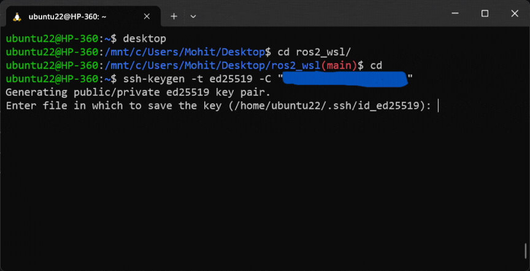
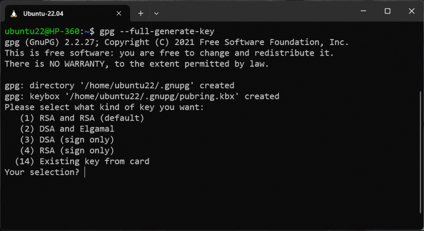

# Setting up git for your linux environment (ubuntu22)

## Pre-requisites
- You should have an active Github account. (Gitlab may also work)

## Setting up SSH Key for your github account
You need an ssh connection between your local machine (the ubuntu system) and remote server (Github account) to push your local code to your github account.

### 1. Install git on your local machine:
```
sudo apt install git
sudo apt install xclip
```

### 2. Config your global git environment with your github credentials:
```
git config --global user.name "yourGithubUsername"
```
```
git config --global user.email "yourPrimaryGithubEmail"
```
Just check if the global git environment is updated or not.
```
git config --global --list
```
It should show your username and email as mentioned by you in previous steps.

### 3. Generate SSH key on your local system:
```
cd ~
ssh-keygen -t ed25519 -C "yourPrimaryGithubEmail"
```
It will prompt you to enter the path where your want to save the ssh key. Just keep pressing `ENTER` to save the file in default location with default passphrase.    
Your ssh key will be saved at `~/.ssh/id_ed25519.pub` file.

### 4. Add your ssh key to ssh agent:
Start the ssh-agent in the background
```
eval "$(ssh-agent -s)"
```
Add your SSH key to ssh agent
```
ssh-add ~/.ssh/id_ed25519
```

### 5. Add SSH Key to your Github:
Copy the ssh key from here
```
cat ~/.ssh/id_ed25519.pub | clip.exe
```
OR use this command to copy the output on Ubuntu-22.04 LTS Desktop
```
cat ~/.ssh/id_ed25519.pub | xclip -selection clipboard
```

Go to your Github `account->Settings->SSH & GPG Keys->Add new ssh key`.   
Name your SSH Key as you want.    
Paste the contents of in the `key` section. Keep the `Key type` as Authentication Key.

### 5. Test your ssh connection:
```
ssh -T git@github.com
```
***Here is a gif demonstrating all the above steps***
<div align="center">
  
</div>


## Setting up GPG connection
By default when you commit in a repo from your local environment and then push them to your remote github respository, those commit are not signed (un verified), Unless you commit direclty from Github.

<div align="center">
  
</div>

So if you want to mark these commits are verified or signed, you need to setup GPG keys for your local system.

### 1. Generate a new GPG key:
Create a new gpg key.    
Keep selecting the first or default options.
```
gpg --full-generate-key
```

List the gpg keys in long format
```
gpg --list-secret-keys --keyid-format=long
```

Export and copy the GPG key. Replace the GPG id with your own GPG Key id
```
gpg --armor --export E68713845D8995D7 | clip.exe
```
OR use this command to copy the output on Ubuntu-22.04 LTS Desktop   
```
gpg --armor --export E68713845D8995D7 | xclip -selection clipboard
```

### 2. Add GPG key to your Github Account:
Follow the same instruction as for SSH Key adding, just select `ADD GPG key` and paste the copied GPG key.

### 3. Telling Git about your signing key:
To do signed commit, you need to inform git that there's a GPG/SSH Key.   

```
git config --global --unset gpg.format
gpg --list-secret-keys --keyid-format=long
```

Replace the GPG id (E68713845D8995D7) with your own GPG id
```
git config --global user.signingkey E68713845D8995D7
```
```
git config --global commit.gpgsign true
git config --global tag.gpgSign true
```
If you are on Ubuntu-22.04 LTS Desktop, run this command as well
```
[ -f ~/.bashrc ] && echo -e '\nexport GPG_TTY=$(tty)' >> ~/.bashrc
```


***Here is a gif demonstrating all the above steps***
<div align="center">
  
</div>

---
