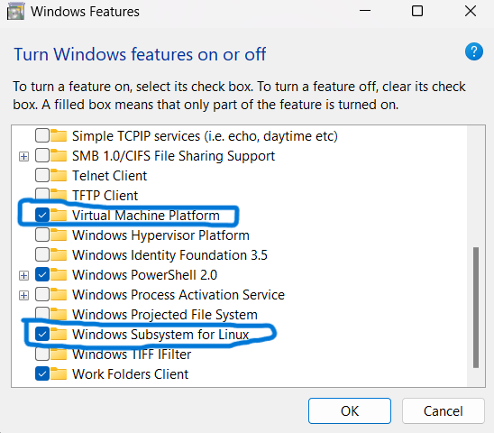
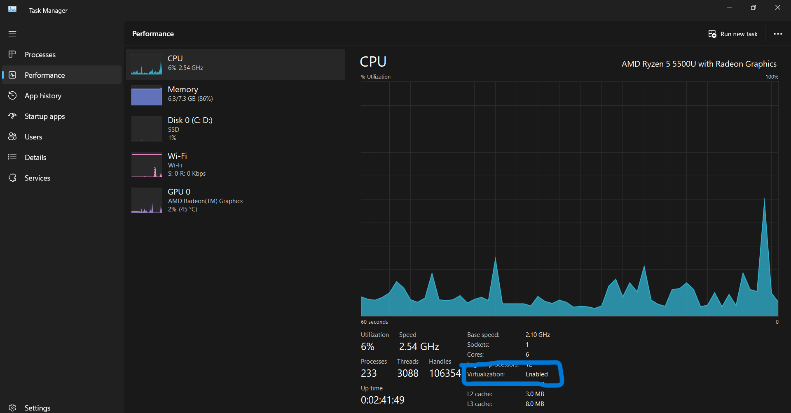
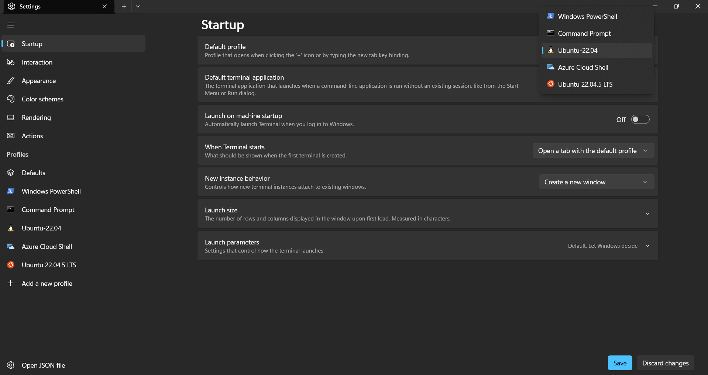
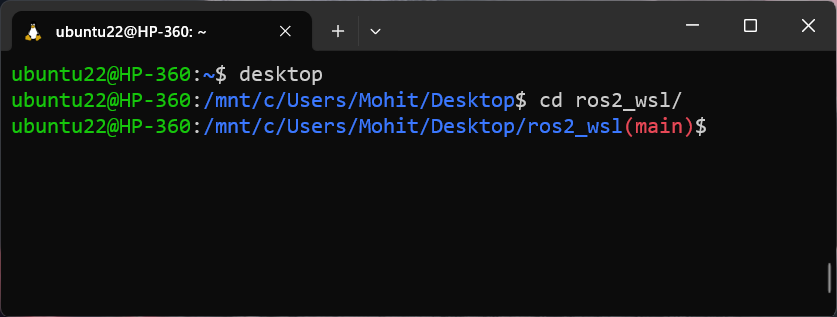
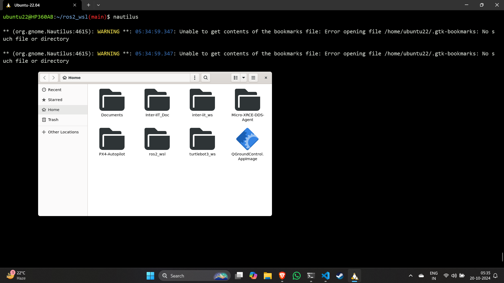
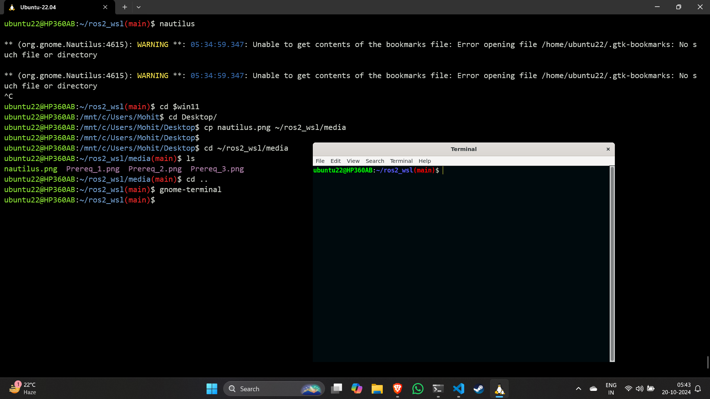

# ROS2 humble in windows using WSL
This packages aims to provide the step by step processes to install ubuntu 22 and ROS2 humble on windows using wsl2 and also install other basic utilities that are helpful while using wsl2.

## 1. Pre-requisites :
- Go to search & type 'Turn windows features on or off' & select the following checkboxes
   
<div align="center">
  
</div>

- Open Task Manager & go to Performance Section. Check if virtualization is enabled or not. If not, then enable it from your bios mode.
<div align="center">
  
</div>
  
- Open windows powershell as administrator & type the following commands
```
wsl --update
wsl --list --online
wsl --install -d Ubuntu-22.04
```
- Create a new user in ubuntu22 by providing a username & password.
- Check if the ubuntu is installed or not
```
lsb_release -a
```
- Now you can Open the terminal from your windows 8 select Ubuntu22 to run ubuntu terminal. Also note that, Powershell will be your default terminal application in windows. So to change that, go to settings in Terminal & select default profile as 'Ubuntu22.04'.

<div align="center">
  
</div>

- Now your Ubuntu 22.04 terminal is ready.
- Type the following commands to update your ubuntu22 to latest packages
```
sudo apt update && sudo apt upgrade -y
```
- Install a GUI editor for ubuntu22 named `gedit`
```
sudo apt install gedit
```
- [Setup Git with SSH/GPG keys](GIT_SETUP.md) on your local system

## 2. Install ROS2 Humble from [***<span style="color:green">here</span>***](https://docs.ros.org/en/humble/Installation/Ubuntu-Install-Debs.html).
- Do source the ros2 distro in your `.bashrc`
```
echo 'source /opt/ros/humble/setup.bash' >> ~/.bashrc
```


# Setting up some utilities for wsl
These utilities are useful to make the wsl work much more like a real Ubuntu distribution.

## 1. Showing current git branch :    
By default the linux terminal doesn't show current git branch in it's prompt. To do this, just add the following line in your `.bashrc` file    

```
# Show git branch name
force_color_prompt=yes
color_prompt=yes
parse_git_branch() {
 git branch 2> /dev/null | sed -e '/^[^*]/d' -e 's/* \(.*\)/(\1)/'
}
if [ "$color_prompt" = yes ]; then
 PS1='${debian_chroot:+($debian_chroot)}\[\033[01;32m\]\u@\h\[\033[00m\]:\[\033[01;34m\]\w\[\033[01;31m\]$(parse_git_branch)\[\033[00m\]\$ '
else
 PS1='${debian_chroot:+($debian_chroot)}\u@\h:\w$(parse_git_branch)\$ '
fi
unset color_prompt force_color_prompt
```
The output will be something like this 

<div align="center">
  
</div>

## 2. Installing Nautilus package :
Nautilus is kind of a gui window that allows you to open any specified path/location in a mini file explorer type window. To install it, run the following command   
```
sudo apt install nautilus
```
To open a specific location with nautilus use the following syntax
`nautilus <path-to-folder>`.   
To open current location with nautilus, use
```
nautilus .
```
It will look something like this
<div align="center">
  
</div>

## 3. Installing Gnome-terminal :
By default the wsl terminals doesn't support gnome features.    
So in case you use some bash files or python scripts that create multiple gnome tabs, they won't work in default wsl terminals for ubuntu.    
In that case, you have to explicitly install gnome-terminal & display it on your screen. To do this, use following commands
```
sudo apt install gnome-terminal
export DISPLAY=:0
gnome-terminal
```
It will looke somthing like this (the color will be different, as i have configured it according to my interest)
<div align="center">
  
</div>    

You can just run `gnome-terminal` command to run the gnome-based terminal.

## *Note* :
The location of `C:\Users\username` in wsl2 is `/mnt/c/Users/username`.
So if you want to acces this location in wsl2 terminal, you can export this value to an environment variable in your `.bashrc` file.
```
export win11='/mnt/c/Users/Mohit'
```
So you can just do the following command to navigate to your windows's user directory from your wsl2 terminal
```
cd $win11
``` 

# Removing ubuntu-22.04 & WSL2 completely from windows

- ### check what distros you have in wsl2 & unregister them:
Open powersheel & type following commands to unregister your installed linux distros
```
wsl -l
wsl --unregister Ubuntu-22.04
```
- Search for `Ubuntu-22.04` in windows search & uninstall it.
- Type following command in powershell to completely remove WSL2 package update
```
Get-AppxPackage MicrosoftCorporationII.WindowsSubsystemForLinux | Remove-AppxPackage
```

- Uninstall WSL2 by running this command in powershell
```
wsl --uninstall
```

- Search for `Turn windows features on or off` & uncheck the options you selected in step 1 of `Pre-requisites`.